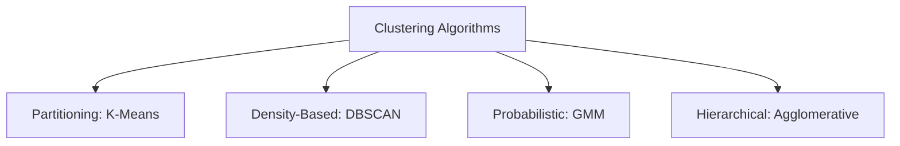

# Phase 4: Algorithm Selection & Justification

## 1. Project Context & Objectives
In unsupervised machine learning, clustering is the task of grouping a set of objects in such a way that objects in the same group (called a cluster) are more similar to each other than to those in other groups. For our capstone project, our primary business objective is to segment a cohort of ~4,300 retail customers into meaningful, distinct profiles based on 7 engineered features: **Recency, Frequency, Monetary value (spend), Average Order Value, Product Diversity (Unique Products), Relationship Duration (Active Days), and Cancellation Rate**.

Selecting the correct clustering algorithm is a fundamental design decision that impacts the shape, interpretability, and business utility of the resulting segments.

---

## 2. In-Depth Algorithm Comparison

We evaluated four candidate clustering algorithms representing different mathematical approaches to unsupervised grouping:

### Comparative Analysis Table

| Algorithm | Mathematical Principle | Key Assumptions | Strengths | Weaknesses | Suitability for RFM Data |
|---|---|---|---|---|---|
| **K-Means** | Minimizes the Within-Cluster Sum of Squares (WCSS): $\sum_{i=1}^{K}\sum_{x \in S_i} \|x - \mu_i\|^2$. | Clusters are spherical, isotropic, and of similar density/size. | Extremely fast ($O(T \cdot K \cdot N)$), easy to implement, and yields highly interpretable centroids. | Vulnerable to extreme outliers and struggles with complex geometries. | **High** (after applying `log1p` transformation and `RobustScaler` preprocessing). |
| **DBSCAN** | Groups points within a distance threshold ($\epsilon$) that contain a minimum number of neighbors ($MinPts$). | Clusters are regions of high density separated by low density. | Automatically identifies noise (outliers) and can find arbitrary shapes. | Sensitive to hyperparameter tuning and struggles with variable densities. | **Medium** (handles cancellation outliers well but merges overlapping customer densities). |
| **GMM** | Soft-clustering that models the data as a mixture of $K$ multivariate Gaussian distributions: $P(x) = \sum_{k=1}^K \pi_k \mathcal{N}(x; \mu_k, \Sigma_k)$. | Data points are generated from a finite mixture of normal distributions. | Flexible cluster shapes (ellipsoids) and outputs soft membership probabilities. | Highly sensitive to initialization; can fail to converge on small sample sizes. | **Medium** (adds math complexity without clear marketing advantages). |
| **Hierarchical (Agglomerative)** | Hierarchically merges pairs of clusters based on linkage criteria (Ward's, single, complete). | Proximity reflects structural hierarchical relationships. | Generates a dendrogram for hierarchy; does not assume spherical clusters. | High computational complexity ($O(N^2 \log N)$), making it slow on larger datasets. | **Low** (computationally prohibitive for large-scale customer transaction tables). |

---

## 3. Mathematical Formulation of Evaluation Metrics

To select the optimal number of clusters ($K$) and justify our final clustering structure, we rely on three quantitative metrics:

### A. Silhouette Coefficient
The Silhouette Coefficient measures how similar an object is to its own cluster (cohesion) compared to other clusters (separation). For a data point $i$:
$$s(i) = \frac{b(i) - a(i)}{\max(a(i), b(i))}$$
Where:
*   $a(i)$ is the mean distance between $i$ and all other points in the same cluster.
*   $b(i)$ is the mean distance from $i$ to the points in the closest neighboring cluster.

*Range:* $[-1, 1]$ (where $+1$ indicates highly distinct clusters, $0$ indicates overlapping clusters, and $-1$ indicates misclassified points).

### B. Davies-Bouldin Index (DBI)
The Davies-Bouldin index evaluates the clustering partition by comparing the average similarity of each cluster with its most similar counterpart. Similarity $R_{ij}$ between cluster $i$ and $j$ is defined as:
$$R_{ij} = \frac{s_i + s_j}{d(\mu_i, \mu_j)}$$
Where $s_i$ and $s_j$ are the average distances of points to their respective centroids $\mu_i$ and $\mu_j$, and $d(\mu_i, \mu_j)$ is the distance between centroids. The index is defined as:
$$DBI = \frac{1}{K} \sum_{i=1}^{K} \max_{j \neq i} R_{ij}$$

*Range:* $[0, \infty)$ (where lower values close to $0$ indicate better clustering with tight, well-separated partitions).

### C. Calinski-Harabasz Score (Variance Ratio Criterion)
The Calinski-Harabasz score is the ratio of the sum of between-cluster dispersion and within-cluster dispersion:
$$s = \frac{\text{Tr}(B_K)}{\text{Tr}(W_K)} \times \frac{N - K}{K - 1}$$
Where:
*   $B_K$ is the between-cluster scatter matrix (separation).
*   $W_K$ is the within-cluster scatter matrix (cohesion).
*   $N$ is the number of data points, and $K$ is the number of clusters.

*Range:* Higher scores indicate better defined, more separated clusters.

---

## 4. Final Selection Rationale

We selected **K-Means Clustering** as our production model due to the following engineering and business trade-offs:

1.  **Marketing Actionability:** Marketing teams require hard-coded boundaries to assign customers to distinct campaigns. Centroids (mean values of Recency, Frequency, Spend) provide an easily interpretable "persona" representing the average customer of that segment.
2.  **Mitigation of Inherent Weaknesses:** K-Means assumes spherical clusters and is sensitive to outliers. We resolved these weaknesses during Phase 2 & 3 preprocessing by applying a `log1p` transformation to right-skewed variables (Monetary, Frequency, Recency, AvgOrderValue, UniqueProducts). This stabilized the variance and symmetrized the distributions. We then applied a `RobustScaler` (scaling by median and IQR) to prevent high-spending outliers from dominating the Euclidean distance calculations.
3.  **Computational Efficiency:** With $O(N)$ complexity, K-Means executes in seconds on our data, allowing for rapid retraining as new transactions arrive.
